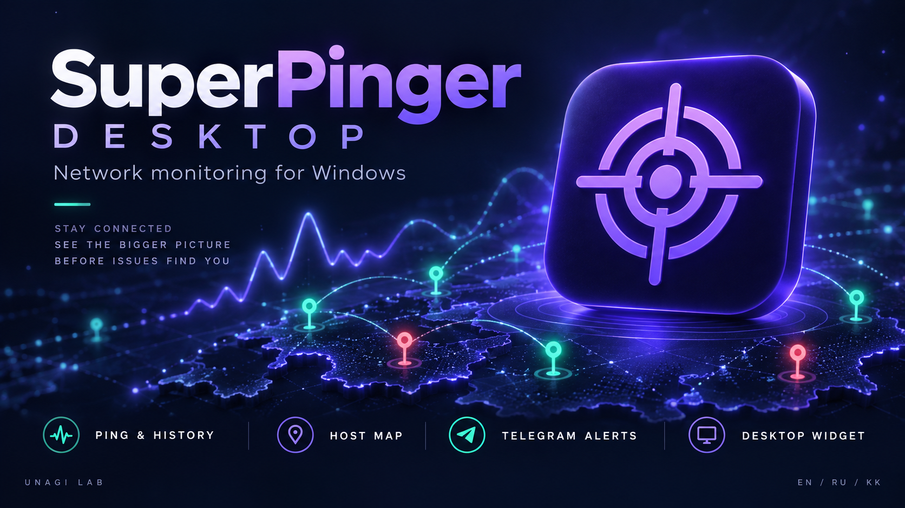
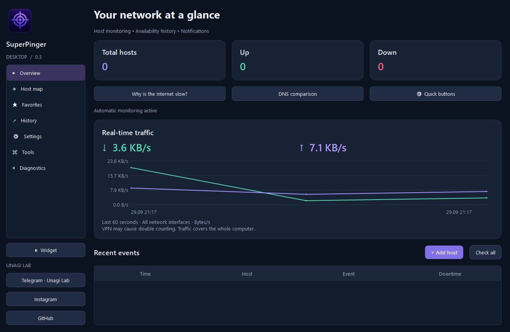

<div align="center">

# SuperPinger Desktop

**Желіңіз бақылауда.**

Windows жүйесіне арналған хосттар мониторингі, пинг тарихы және желі диагностикасы.

[English](README.md) · [Русский](README.ru.md) · **Қазақша**



**Windows 10/11 x64 · Python + PySide6 · SQLite · 0.3 нұсқасы**

[Telegram](https://t.me/unagilab) · [Instagram](https://www.instagram.com/cyber_unagi_maki/) · [GitHub](https://github.com/CyberUnagiMaki)

</div>

## Жоба туралы

SuperPinger Desktop мобильді SuperPinger жобасының мониторинг мүмкіндіктерін Windows жүйесіне әкеледі. Хосттарды картаға орналастырыңыз, қолжетімділігін бақылаңыз, пинг графиктерін қараңыз және хост қолжетімсіз болғанда не қалпына келгенде Telegram хабарландыруларын алыңыз. Қолданба жүйелік трейге жасырылғанда да мониторинг жалғасады.



## Мүмкіндіктер

| Мүмкіндік | Не істеуге болады |
|---|---|
| **Хосттар мониторингі** | IPv4, IPv6 және DNS атауларын автоматты немесе қолмен тексеру. Әр хост үшін ICMP деректерінің өлшемін, күту уақытын және сәтсіз тексерулер шегін орнату. |
| **Интерактивті карта** | OpenStreetMap картасынан орын таңдап, хост атауы мен мекенжайын бекіту. Жасыл белгі — қолжетімді, қызыл — қолжетімсіз. Әр нүкте таңдаулыларға да қосылады. |
| **Тарих пен графиктер** | Пинг өлшемдерін, үзілістер мен қалпына келулерді SQLite дерекқорында сақтау. Графиктерді қарау және тарихты CSV форматына шығару. |
| **Нақты уақыттағы трафик** | Компьютердің кіріс және шығыс трафигін, соңғы 60 секунд графигін және жиналған трафик есебін көру. |
| **Telegram хабарландырулары** | Өз ботыңызды қосып, қажет хосттар үшін хабарландыруларды іске қосу. Жіберілмеген хабарлар қайталау кезегінде сақталады. |
| **Трей мен виджет** | Фонда мониторинг жүргізу. Таңдалған хосттар немесе трафик көрсетілетін жылжымалы виджетті, графиктерді және басқа терезелердің үстінде көрсету режимін баптау. |
| **Желілік құралдар** | Бір реттік пинг, маршрутты қадағалау, DNS сұраулары мен салыстыру, WHOIS, TCP порттары мен LAN сканерлері, HTTPS тексеруі, сыртқы IP және желілік интерфейстер. |
| **Диагностика** | Профильдерді сақтау, байланыс сапасы сеанстарын бастау, пакет жоғалуы мен jitter көрсеткішін бағалау, есептерді салыстыру және қолдау қызметіне ZIP есебін шығару. |
| **Жеке баптаулар** | Ағылшын, орыс және қазақ тілдері; қараңғы, ашық немесе жүйелік тақырып; тыныш режим және мониторингті тоқтату таймері. |

**Тексеру аралықтары:** 1, 5, 15, 30 минут; 1 немесе 3 сағат. ICMP деректерінің өлшемі: **1–65 000 байт**. Күту уақыты: **250–10 000 мс**.

## Windows жүйесінде іске қосу

1. Релизге тіркелген болса, `SuperPingerDesktop-v0.3-Windows-x64.zip` Windows архивін жүктеп алыңыз.
2. **Бүкіл архивті** жеке қалтаға шығарыңыз.
3. `SuperPingerDesktop.exe` файлын іске қосыңыз. `_internal` қалтасы EXE жанында қалуы керек.

Дайын қолданба үшін Python орнату қажет емес. Бастапқы код `source/` қалтасына енгізілген. Қазіргі жинаққа цифрлық қолтаңба қойылмаған.

Жаңарту үшін ескі нұсқадан трей мәзірі арқылы шығып, жаңа нұсқаны бөлек қалтаға шығарыңыз. Хосттар, тарих пен баптаулар бұрынғы жергілікті дерекқорда сақталады.

## Алғашқы хостты қосу

1. **«Хосттар картасы»** бөлімін ашып, қажет орынды басыңыз немесе хостты координаттар бойынша қосыңыз.
2. Атауын және IP мекенжайын не DNS атауын енгізіңіз.
3. Тексеру аралығын, пакет өлшемін, күту уақытын және сәтсіз тексерулер шегін орнатыңыз.
4. Сақтаңыз: хост картада және **«Таңдаулылар»** бөлімінде пайда болады.
5. График пен оқиғаларды ашу үшін хостты екі рет басыңыз. **«Қазір пингтеу»** батырмасы қолмен тексеруді бастайды.

Координаттарды өзіңіз таңдайсыз: IP мекенжайы картадағы орынды анықтамайды. Әдепкіде қатарынан екі сәтсіз тексеруден кейін хост «Қолжетімсіз» күйіне өтеді. Қолмен тексеру де күйге әсер етеді.

## Интерфейс тілі

**Settings → Interface language** бөлімінен **English / Русский / Қазақша** тілдерінің бірін таңдаңыз. Әдепкі тіл — ағылшын тілі. Таңдау бірден сақталады және толық қайта іске қосқаннан кейін қолданылады: **трей мәзірі → Exit / Шығу**, содан кейін қолданбаны қайта ашыңыз. Трейге жасыру қайта іске қосу болып саналмайды.

Пайдаланушы берген атаулар мен бұрын сақталған нәтижелер бастапқы күйінде қалады. Жүйелік командалардың нәтижелері, Windows терезелері мен карта жазулары өз тілінде көрсетілуі мүмкін.

## Telegram қосу

1. [@BotFather](https://t.me/BotFather) арқылы бот жасаңыз.
2. Ботқа `/start` жіберіңіз немесе оны хабар жіберуге рұқсаты бар топқа қосыңыз.
3. **«Баптаулар»** бөлімінде токен мен chat ID енгізіп, хабарландыруларды қосыңыз және сақтаңыз.
4. Қосылымды тексеру үшін **«Сынақ жіберу»** батырмасын басыңыз.
5. Әр қажетті хосттың баптауларында Telegram хабарландыруларын қосыңыз.

Токен ағымдағы Windows пайдаланушысы үшін Windows DPAPI арқылы қорғалады. Жеткізу қатесі болса, бес әрекетке дейін қайталанады; **«Кезекті қайталау»** батырмасы оларды қайта бастайды. Бот хабарландырулар жібереді; Telegram командаларымен компьютерді басқару қарастырылмаған.

## Деректер және жұмыс ерекшеліктері

- Дерекқор: `%LOCALAPPDATA%\SuperPingerDesktop\monitor.sqlite3`.
- SQLite сақтық көшірмесін **«Баптаулар → Дерекқордың сақтық көшірмесі»** арқылы жасауға болады.
- Қолданба іске қосылып тұруы керек. Компьютер ұйқыда немесе өшірулі болса, тексерулер орындалмайды. 0.3 нұсқасы Windows қызметі емес және кірістірілген автоматты іске қосу мүмкіндігі жоқ.
- Пакет жоғалуы ICMP сүзгіленуін немесе күту уақытының бітуін білдіруі мүмкін; бұл құрылғының өшкенін дәлелдемейді.
- Трафик қолданба жұмыс істегенде барлық интерфейстер бойынша қосылады. VPN қосарлы есепке әкелуі мүмкін. Бұл жеке хосттың трафигі немесе оператордың төлем есебі емес.
- Картаның жаңа аймақтары үшін интернет қажет. Карта қолжетімсіз болса да, пинг жұмыс істейді.

## Бастапқы кодтан іске қосу

**Windows және Python 3.12 x64** қажет. Репозиторийдің түбірлік қалтасында PowerShell ашыңыз:

```powershell
py -3.12 -m venv .venv
.\.venv\Scripts\python.exe -m pip install -r requirements.txt
.\.venv\Scripts\python.exe app.py
```

Windows нұсқасын жинау:

```powershell
.\.venv\Scripts\python.exe -m PyInstaller --noconfirm SuperPingerDesktop.spec
```

Нәтиже: `dist/SuperPingerDesktop/`. `build.ps1` скрипті де ортаны жасап, қолданбаны жинай алады.

Тесттерді іске қосу:

```powershell
.\.venv\Scripts\python.exe -m unittest discover -p "test_*.py" -v
```

0.3 нұсқасы 33 автоматты тесттен және үш тілдегі EXE іске қосу тексерулерінен өтті. Telegram арқылы нақты жеткізу мен DPAPI токенін сақтауды кәдімгі Windows тіркелгісінде нақты ботпен әлі тексеру керек: оқшауланған жинау ортасында бұл сценарий расталмады.

## Жоба құрылымы

```text
app.py                  Негізгі терезе, баптаулар және трей
core.py                 SQLite, хост пингі және токенді қорғау
monitor.py              Тексеру кестесі және хабарландыруларды жеткізу
mapview.py              OpenStreetMap және хост белгілері
widgets.py              Графиктер, хост диалогтары және виджет
nettools.py             Желілік құралдар
diagnostics.py          Диагностика сеанстары мен есептері
extras_ui.py            Құралдар мен диагностика интерфейсі
i18n.py / translations.py  Тілді жүктеу және хабарлар сөздігі
docs/                   Толық нұсқаулық, постер және скриншот
```

## Құжаттама және құрамдастар

- [Орыс тіліндегі толық нұсқаулық](docs/GUIDE.ru.md)
- [Өзгерістер тарихы](CHANGELOG.md)
- [Үшінші тарап құрамдастары туралы ақпарат](THIRD_PARTY.md)

Карта деректері © [OpenStreetMap contributors](https://www.openstreetmap.org/copyright). Қолданба Python, PySide6/Qt және psutil пайдаланады; PyInstaller арқылы жиналады. Постер — жарнамалық иллюстрация, ал басты бет суреті — қолданбаның нақты скриншоты.

**UNAGI LAB** — [Telegram](https://t.me/unagilab) · [Instagram](https://www.instagram.com/cyber_unagi_maki/) · [GitHub](https://github.com/CyberUnagiMaki)
